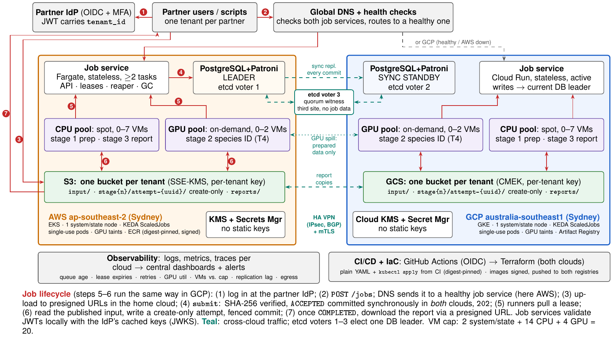

# Multi-Cloud Wildlife-Image Job-Processing Service

Design report for the FIT3184 (Monash University) bonus task: a cloud service where partner
organisations submit 1–5 GB wildlife-image batches that run through a three-stage pipeline
(**CPU prep → GPU species ID → CPU report**) across **AWS and GCP**, under a hard cap of
**20 VMs (≤ 4 GPU)**.

**Author:** YICHEN HUANG · **Submitted:** 9 October 2026 · Design only, no implementation.

📄 **Report:** [`report/main.pdf`](report/main.pdf) (cover + contents + 5 content pages + references)



---

## Core ideas

1. **One transactional store.** PostgreSQL holds job state, the work queue and leases, so there is
   never a dual-write between a queue and a database.
2. **At-least-once execution, exactly-once publication.** Workers pull leases carrying a fencing
   epoch, write to create-only per-attempt prefixes, and a conditional commit (checked with
   `clock_timestamp()`) publishes exactly one attempt per stage.
3. **Active-active compute, data-local placement.** Both clouds run workers every day; each job
   runs where its data lives, so only reports, metadata and rare prepared-data spills cross clouds.
4. **Quorum-governed state.** PostgreSQL + Patroni with a *synchronous* standby in the other cloud
   (same Sydney metro, < 5 ms) and a three-voter etcd quorum (AWS, GCP, third-site witness).
   An isolated old leader cannot acknowledge a write, failover is automatic, and RPO = 0 for
   acknowledged decisions.

## Failure scenario (required by the brief)

A GPU VM writes its stage output, then disappears before reporting success:

| Time | What happens |
|---|---|
| t0 | G1 holds the lease (`epoch=7`, attempt `A`) and writes `stage2/attempt-A/` create-only |
| t1 | G1 is unreachable; its credentials may outlive the lease (STS ≥ 15 min) but can only write `attempt-A/`, which nobody reads |
| +90 s | Reaper marks `A` abandoned and requeues; the epoch is unchanged |
| t2 | G2 claims (`epoch=8`, attempt `B`) and publishes via a fenced conditional `UPDATE` |
| t3 | G1 returns, commits with `epoch=7` → 0 rows → `409 STALE_LEASE` |
| +24 h | GC deletes the unreferenced `attempt-A/` |

## Multi-cloud behaviour

| Failure | Behaviour |
|---|---|
| AWS unreachable | GCP + witness hold quorum; GCP is promoted in ≈30–60 s with every acknowledged commit and keeps accepting work |
| GCP unreachable | AWS + witness hold quorum; AWS drops GCP from `/sync` and continues |
| Link-only partition | AWS keeps the leader key; GCP cannot be promoted |
| Witness down | AWS + GCP still form a quorum |
| Capacity after a loss | Survivor keeps its 10 VMs; after the other cloud's VMs are confirmed terminated, CI raises its limits up to 20 VMs / 4 GPUs |

## Key numbers (planning figures)

- 4 × T4 GPUs → **40 jobs/h**; a 100-job burst needs ≥ 2.5 h of GPU time.
- VM budget per cloud: 1 system/state node + 0–7 CPU + 0–2 GPU → **2 + 14 + 4 = 20**.
- GPUs on demand ≈ **$0.46k/month** vs always-on ≈ $2.0k/month.
- Data-local placement avoids ≈ **$1.0–1.5k/month** of egress for mirroring raw inputs.

The full trade-off table, including lessons carried over from my SmartPark assignment (A1), is in
§10 of the report.

## Repository layout

| Path | Contents |
|---|---|
| `report/main.tex` → `report/main.pdf` | The report (LaTeX, Overleaf-compatible) |
| `diagrams/architecture.tex` → `.pdf` / `.png` | Architecture diagram (TikZ, vector; PNG for this README) |
| `notes/assumptions.md` | Sizing calculations and assumptions (workload, network, prices, storage, third parties) |
| `notes/decisions.md` | Design decision log with the final choice and trade-off for each |
| `notes/verification.md` | Source and evidence level for every external fact, price and reference link |

## Build

```bash
cd diagrams && latexmk -pdf architecture.tex      # only after editing the diagram
pdftoppm -r 220 -png -singlefile architecture.pdf architecture   # refresh the README image
cd ../report && latexmk -pdf main.tex
```

On Overleaf: upload `report/` and `diagrams/` keeping the folder structure and set
`report/main.tex` as the main file.

## License

[MIT](LICENSE)
